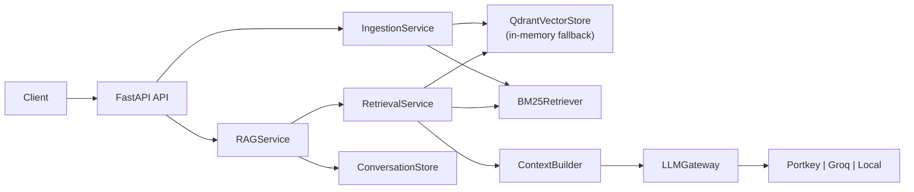
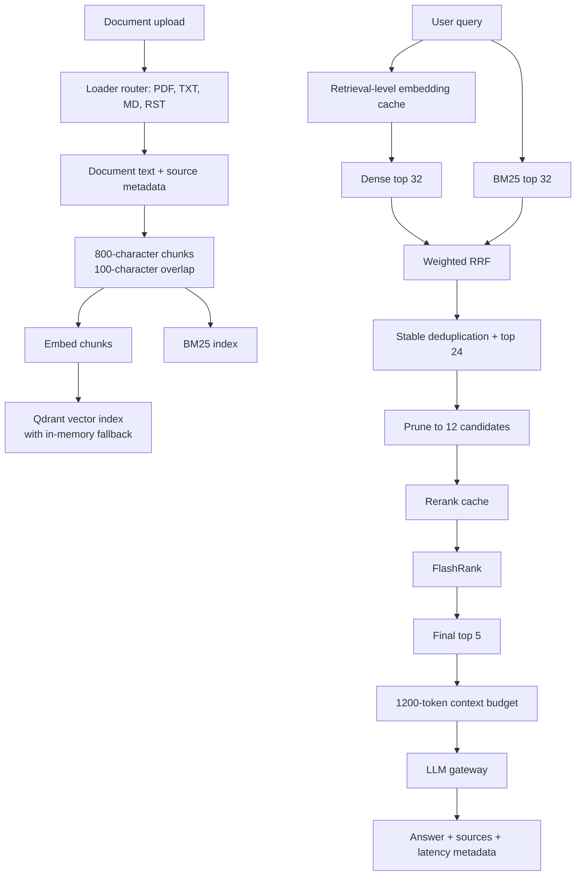
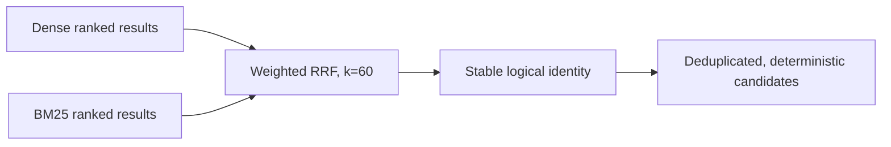
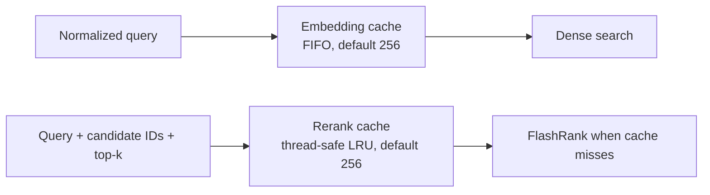
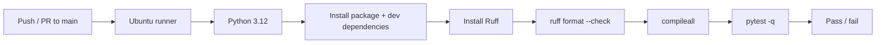

# Enterprise Agentic RAG — Scalable Pipeline

> A production-oriented, CI-validated Retrieval-Augmented Generation (RAG) service that combines dense retrieval, BM25, weighted Reciprocal Rank Fusion (RRF), candidate budgets, FlashRank reranking, bounded caches, evaluation, and a provider-neutral LLM gateway.

This repository demonstrates the engineering around a retrieval system—not merely a vector-search demo. It is designed for production deployment, with explicit failure boundaries, deterministic ranking rules, local fallbacks, evaluation tooling, and automated CI. It is **not presented as a currently deployed production service**.

## Why this project

Enterprise retrieval must handle both semantic questions and exact organizational language. A query such as “how does this policy affect retention?” benefits from semantic similarity; a query containing a ticket number, control identifier, product name, or rare acronym needs lexical precision. This system retrieves through both paths, combines rank evidence rather than incomparable raw scores, constrains downstream work, then reranks only a small candidate set before generation.

## System architecture



The FastAPI application is assembled in `app/main.py`. At startup it constructs the Gemini embedder, Qdrant-backed store, BM25 index, retrieval service, context builder, and LLM gateway. It attempts to hydrate the in-process BM25 index from documents persisted in Qdrant; a hydration error is logged as a warning rather than preventing application startup.

## End-to-end workflow



### Ingestion

`POST /api/v1/documents/upload` writes the uploaded file to a temporary path, routes it by extension, chunks it, and adds those chunks to both retrieval systems. `PDFLoader` uses `pypdf`; `TextLoader` handles `.txt`, `.md`, and `.rst`. The loader abstraction isolates format-specific extraction from indexing.

Each chunk carries its text, source path, and metadata. The default splitter uses 800-character windows with 100 characters of overlap. This is deliberately simple and transparent: overlap helps avoid losing context at a boundary, while bounded chunk size controls embedding and reranking work. Unsupported types and loader failures become HTTP 400 responses; temporary upload files are removed in a `finally` block.

### Retrieval and response generation

For a non-empty query, `RetrievalService` first obtains a query embedding, then calls dense and lexical retrieval independently. Fused candidates are constrained before reranking. `ContextBuilder` consumes final documents in rank order and includes only the words that fit its 1,200-token-style word budget (the implementation counts whitespace-separated words). `RAGService` sends that context to the configured gateway, records conversation messages in the in-memory `ConversationStore`, and returns the answer, selected sources, token information, and timing metadata.

The context guardrail prevents unbounded prompt growth. Its trade-off is that a lower-ranked source may be omitted once the budget is full; this makes the retrieval ranking and `top_k` selection especially important.

## Hybrid retrieval, precisely

### Dense search

`GeminiEmbedder` uses Gemini embeddings when a usable Gemini client/API key is available. Otherwise it produces a deterministic normalized SHA-256-derived vector so tests and local development remain reproducible. `QdrantVectorStore` persists vectors to Qdrant when available, but falls back to an in-memory dot-product store if the client cannot be initialized or a Qdrant operation fails.

Dense search handles semantic similarity and paraphrases well, but it can miss exact identifiers or rare terms. Query embedding and vector search are separate calls so their latency is observable independently.

### BM25 lexical search

`BM25Retriever` implements Okapi BM25 directly. It lowercases and tokenizes with `\w+`, builds per-document term-frequency counters, document frequencies, Robertson/Sparck Jones-style IDF values, document lengths, and average document length. Defaults are `k1=1.5` and `b=0.75`.

For each distinct query term, scoring applies:

```text
IDF(term) × (tf × (k1 + 1)) / (tf + k1 × (1 - b + b × dl / avgdl))
```

Positive-score documents are sorted descending and clipped to the requested limit. Adding documents rebuilds the index statistics, trading incremental-update efficiency for a straightforward, internally consistent index. BM25 supplies exact-term, identifier, and terminology recall that dense retrieval alone may not provide.

### Weighted Reciprocal Rank Fusion

The system does not combine raw vector and BM25 scores: their scales are not comparable. Instead it combines each rank list’s evidence:

```text
score(document) = dense_weight   / (k + dense_rank)
                + lexical_weight / (k + lexical_rank)
```

The implementation defaults to `k=60`, `dense_weight=1.0`, and `lexical_weight=1.0`. Weights must be positive. The sweep tool can test asymmetric weights without changing the production service’s normal defaults.



Deduplication is based on logical identity rather than Python object identity, because Qdrant and BM25 may materialize separate objects for the same chunk. Fusion prefers `metadata.chunk_id`, then `metadata.id`, source/span, and finally source/text. Ties are resolved by the stable identity key, making output deterministic. The output is then limited to the configured RRF capacity.

### Candidate budgets and reranking

The application defaults are:

| Stage | Default | Purpose |
|---|---:|---|
| Dense candidates | 32 | semantic recall budget |
| BM25 candidates | 32 | lexical recall budget |
| RRF candidates | 24 | fused candidate cap |
| Rerank candidates | 12 | expensive-model work cap |
| Final results | 5 | sources passed to context construction |

Reranking happens after fusion, not over the corpus. `FlashRankReranker` initializes `ms-marco-MiniLM-L-12-v2` once per process and ranks only the pruned candidate set. If FlashRank/model initialization or execution is unavailable, it preserves offline behavior through a deterministic lexical-overlap fallback. This keeps the pipeline usable in constrained environments, but the fallback is not a claim of equivalent learned-reranker quality.

## Retrieval guardrails and observability

`RetrievalService` enforces the principle: **fail fast at the boundary rather than allowing invalid retrieval state to propagate downstream.** Constructor validation rejects non-positive budgets or cache sizes, candidate stages that cannot satisfy `top_k`, a rerank budget larger than RRF capacity, and an RRF capacity larger than the combined upstream capacity. The settings model mirrors these relationships.

At query time, it rejects blank queries; errors if both retrieval indexes return no candidates; errors if RRF returns no candidates or exceeds capacity; and errors if reranking returns no final result or more than the requested count. These are operationally important invariants: a bad configuration should not quietly yield arbitrary prompts or partial, misleading answers.

Each retrieval records embedding, dense search, BM25, RRF, rerank-cache lookup, FlashRank execution, and total latency. `/metrics` returns count, P50, P95, and mean for recorded stages (with `rerank` retained as a compatibility alias for FlashRank). P95 is particularly useful for service engineering because a mean can hide slow tail requests that users experience.

## Caching boundaries



There are two retrieval-level caches:

- **Query embedding cache:** keyed by stripped query text. It returns a copy on hit, tracks hits/misses and hit rate, and uses bounded FIFO eviction in `RetrievalService`. `clear_embedding_cache()` supports cold-cache benchmarks and operational invalidation.
- **Rerank cache:** keyed by a SHA-256 digest of stripped query, requested limit, and the ordered stable identities of the pruned candidates. It is query-sensitive and candidate-sensitive, so a different candidate set cannot reuse an old order. `BoundedLRUCache` is thread-safe, promotes hits to MRU, evicts LRU entries, exposes size/capacity/hits/misses/hit rate, and can be cleared.

The embedder itself also has a bounded, thread-safe LRU cache (default 2,048). Caching is deliberately applied at retrieval boundaries rather than caching entire RAG answers: retrieval reuse avoids repeat embedding/reranking cost while still permitting a fresh answer, context, memory state, or provider result.

## Evaluation and tuning

The repository contains a 20-case evaluation dataset in `app/evaluation/data/rag_eval.json`. Each case has an ID, natural-language query, and one or more expected `relevant_chunk_ids`. The runner loads the Attention Is All You Need PDF from `data/NIPS-2017-attention-is-all-you-need-Paper.pdf`, chunks it in order, assigns `chunk_001`-style IDs, and evaluates retrieved IDs.

| Metric | Meaning |
|---|---|
| Recall@3 | Fraction of cases with at least one relevant chunk in the first 3 results |
| Recall@5 | Same success criterion in the first 5 results |
| MRR | Mean of `1 / rank` of the first relevant result (0 if none is found) |

Recall@K asks whether retrieval surfaced a relevant source within a working set; MRR rewards surfacing that source earlier. Neither substitutes for the other. The implementation validates dataset shape and requires aligned retrieval/relevance lists before scoring.

`app/evaluation/benchmark.py` also separates cold- and warm-cache latency measurements for embedding, dense retrieval, BM25, RRF, rerank-cache lookup, FlashRank, and total latency, reporting P50, P95, and mean. Results depend on hardware, available models/services, and the local corpus, so the repository does not claim a production SLA.

### Automated parameter sweep

`app/evaluation/sweep.py` frames tuning as an empirical measurement problem instead of intuition-driven adjustment. It explores dense/BM25/RRF/rerank budgets and dense/lexical RRF weights, validating every configuration before evaluation. The declared grid produces **441 valid configurations**.

For each point, the sweep shares already-built stores, executes the full retrieval path, computes Recall@3, Recall@5, MRR, mean latency, and P95 latency, then selects deterministically by Recall@3, MRR, Recall@5, lower P95, and lower total candidate budget. The weighting is injected at the fusion boundary so the production pipeline remains unchanged.

Exhaustive sweeps can become expensive when a real FlashRank model is active. That workload belongs in deliberate benchmarking, not the normal CI gate; keeping it separate makes CI a fast correctness signal while preserving a path for quality/latency optimization.

## API

| Endpoint | Behavior |
|---|---|
| `GET /health` | Liveness response: `{ "status": "ok" }` |
| `GET /ready` | Readiness snapshot with document count and embedder-cache stats |
| `GET /metrics` | Retrieval latency aggregates |
| `POST /api/v1/documents/upload` | Multipart PDF/text/Markdown/reStructuredText ingestion |
| `GET /api/v1/documents/count` | Current vector-store count |
| `POST /api/v1/rag/query` | Query, optional conversation ID, optional `top_k` (1–20) |

Health indicates that the HTTP application is alive. Readiness additionally exposes component-facing state: indexed document count and embedder cache statistics. It is not a deep external-dependency health probe.

Example:

```bash
curl -X POST http://localhost:8000/api/v1/rag/query \
  -H 'content-type: application/json' \
  -d '{"query":"What does the document say about retention?", "conversation_id":"demo"}'
```

## LLM gateway and memory

`LLMGateway` decouples RAG orchestration from a specific model provider. The application chooses Portkey when both Portkey keys exist, otherwise Groq when its key exists, otherwise a deterministic `LocalProvider`. `OpenAICompatibleProvider` supplies the shared HTTP chat-completions adapter used by `GroqProvider` and `PortkeyProvider`.

The gateway supports provider contracts, request/response models, retry with exponential backoff for selected transient HTTP codes, per-provider circuit breakers, primary-to-fallback failover, attempt history, latency/token accounting, and serializable metrics. The default configuration has two retries, a circuit threshold of three failures, and a 30-second reset. This abstraction improves vendor flexibility, testing, and failure isolation without coupling the RAG service to one SDK.

Conversation memory is an in-process, bounded `ConversationStore` (20 messages per conversation). It records user and assistant messages; the current RAG query path does not yet inject prior messages into the prompt. That distinction matters: it is a memory component, not a claim of conversational-context prompting.

## Configuration and local development

```bash
cp .env.example .env
python3 -m pip install -e '.[dev]'
python3 -m uvicorn app.main:app --reload
```

Useful commands:

```bash
make compile
make test
make run
make evaluation
make benchmark
python3 -m app.evaluation.sweep
```

Key defaults live in `app/config.py`: 3,072 embedding dimensions, `enterprise_documents` as the Qdrant collection, embedder cache size 2,048, retrieval cache defaults, candidate budgets above, top-5 results, and a 1,200-token context budget. Qdrant and Gemini are optional for local/offline operation through the documented fallbacks; configure credentials in `.env` to use those integrations.

## Test, packaging, and CI engineering

The CI-validated baseline is **73 passing tests**. The suite covers core embeddings/BM25/evaluation helpers, API metrics, gateway retries/failover/circuit behavior, FlashRank contracts, cache LRU semantics, RRF determinism and weight validation, retrieval configuration guardrails, evaluation/sweep contracts, and the upload-to-query pipeline. Contract tests are especially useful here: they protect interfaces and ranking/capacity invariants while internals evolve.

GitHub Actions runs on pushes and pull requests targeting `main`:



This is continuous integration, not continuous deployment. The workflow validates formatting, compilation, and tests; it contains no deployment stage. The repository history also documents two practical dependency-hygiene lessons: explicit setuptools discovery now includes `app*` and excludes `data*`/`tests*`, avoiding flat-layout discovery conflicts; and `python-multipart` was added as a production dependency after clean GitHub CI exposed an upload dependency that happened to exist locally. Those are exactly the sort of clean-environment failures CI is meant to reveal.

## Production engineering challenges & decisions

| Problem | Decision and validation | Trade-off |
|---|---|---|
| Dense and lexical results disagree | Fuse independent rank evidence with weighted RRF, stable identity, and deterministic ties; retrieval contract tests cover weighted evidence and ordering. | RRF intentionally discards raw score magnitude. |
| Same chunk arrives as separate objects | Identify chunks via metadata/source/span/text rather than object identity. | Identity quality depends on supplied metadata. |
| Candidate explosion makes reranking costly | Cap dense, BM25, RRF, and rerank sets; rerank only fused candidates. | Budgets can exclude a long-tail relevant result. |
| Repeat embedding/reranking cost | Use bounded, observable retrieval caches with explicit clear operations. | Caches are process-local and capacity-bounded. |
| Invalid retrieval states | Validate interdependent capacities at construction and check empty/oversized outputs at runtime. | Invalid requests fail explicitly instead of returning degraded output. |
| Ranking quality is hard to judge by intuition | Keep a labeled 20-case evaluation set, benchmark quality/latency, and provide a validated 441-point sweep. | Representative datasets require continued maintenance. |
| Provider failures | Use transient retry, circuit breakers, fallback behavior, and local offline provider. | Local fallback is deterministic but not a hosted-model substitute. |
| Reproducibility across environments | Package explicitly and verify on clean GitHub Actions runners. | CI checks correctness, not deployment readiness of external credentials/infrastructure. |

## Technology stack

| Area | Technology |
|---|---|
| API | Python, FastAPI, Uvicorn |
| Validation/configuration | Pydantic Settings |
| Dense retrieval | Gemini embedder integration, Qdrant client, in-memory fallback |
| Lexical retrieval | In-repository Okapi BM25 |
| Fusion/reranking | Weighted RRF, FlashRank |
| Generation gateway | Local provider, Groq-compatible adapter, Portkey-compatible adapter |
| Ingestion | pypdf and text loaders |
| Testing | pytest, httpx |
| Packaging/quality | setuptools, Ruff |
| CI | GitHub Actions |

## Repository map

```text
app/
  api/           HTTP routers
  embeddings/    Gemini embedder + deterministic fallback
  evaluation/    metrics, runner, benchmark, parameter sweep, dataset
  gateway/       provider-neutral generation gateway and adapters
  ingestion/     document models and PDF/text loaders
  memory/        bounded in-process conversation store
  reranking/     FlashRank adapter + fallback
  retrieval/     vector store, BM25, fusion, caches, orchestration
  services/      ingestion, context construction, RAG orchestration
tests/           API, evaluation, gateway, reranking, retrieval, pipeline tests
.github/         CI workflow
```

## Current maturity

This is a serious, **production-oriented** RAG engineering implementation: it has explicit interfaces, fallbacks, bounded work, observability, evaluation, packaging, and CI. Production deployment would still require environment-specific operational work—managed secrets, durable infrastructure configuration, monitoring/alerting, authentication/authorization, and deployment automation—which is intentionally not claimed by this repository.
